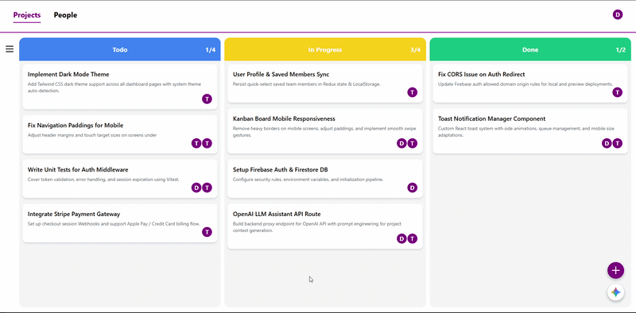
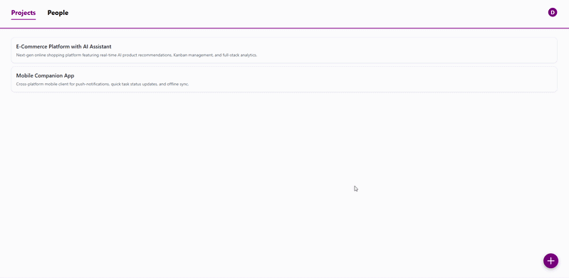
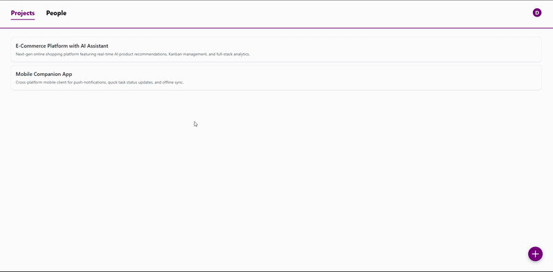
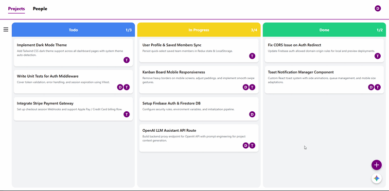
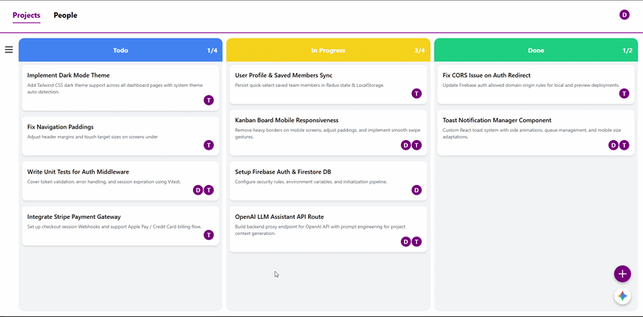
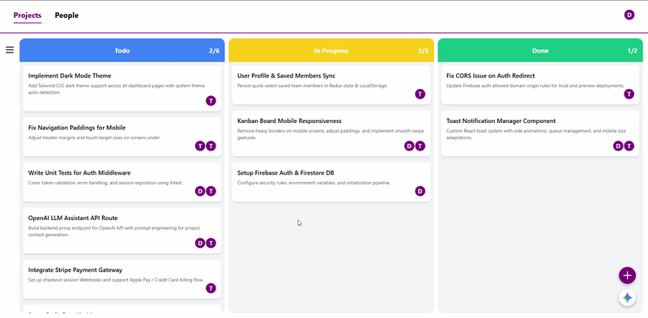
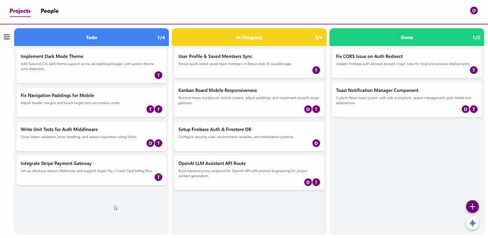
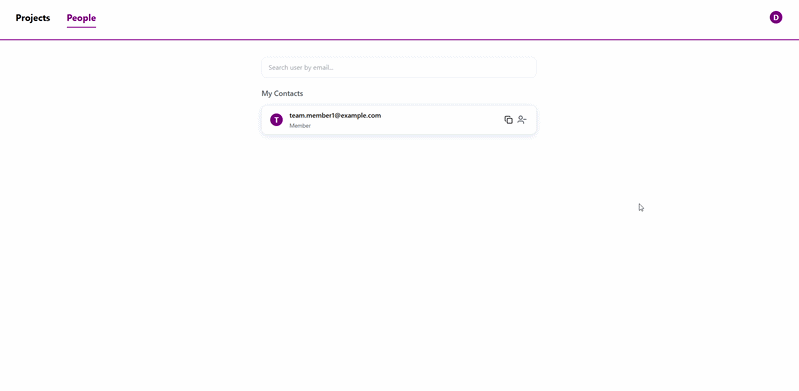
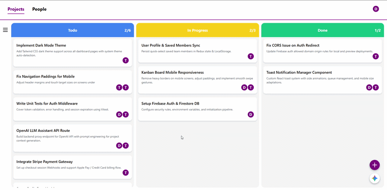

# 🚀 ProjectFlow — AI-Driven Project Management Tool

> An intelligent, full-stack project management platform with an integrated AI Assistant that automates project workflows using natural language commands.

🌐 **Live Application:** [Click here to open ProjectFlow](https://project-management-tool-with-ai-ass-two.vercel.app)

> 🔗 **URL:** `https://project-management-tool-with-ai-ass-two.vercel.app`

---

## 🔑 Demo Access

To explore pre-configured projects, tasks, and team members without registering, use the following demo credentials:

* **Email:** `demo.user@example.com`
* **Password:** `password123`

---

## ✨ Features Showcase

### 1. 🤖 AI Assistant Workflow
Execute complex project actions, update task statuses, and decompose workflows via natural language chat.

---

### 2. 📂 Project Management
Create, edit, delete, and seamlessly switch between multiple projects.

---

### 3. 📝 Task Operations & Drag-and-Drop
Full control over task lifecycles with detail modals, quick updates, and dynamic board management.

---

### 4. 🔍 Advanced Filtering & Sorting
Filter tasks by assignees, status, priority, type, and categories in real-time.

---

### 5. 👁️ Custom View & Layout Controls
Flexible UI options: toggle column task counters, expand/hide the AI chat panel, and focus on your work.

---

### 6. 👥 Team & Member Management
Invite team members, view contacts, and assign roles across projects.

---

### 7. 🎨 Personalization & Themes
Customize your workspace with custom color themes and layout preferences.

---

## 🛠️ Tech Stack

* **Frontend:** React 19, TypeScript, Vite, React Router v7
* **State & Data Management:** Zustand, TanStack Query (React Query)
* **Styling & Components:** Tailwind CSS v4, Lucide React, clsx
* **Drag and Drop:** @hello-pangea/dnd
* **Backend & Database:** Firebase (Authentication & Firestore)
* **AI Engine:** Google Gemini API (`@google/generative-ai`)

---

## 💡 Engineering & Architecture Highlights

* **Structured Prompt Processing:** Parses natural language intent into real-time Firestore database mutations.
* **Optimistic UI & Caching:** Powered by TanStack Query and Zustand for fast UI responses.
* **Clean & Modular Architecture:** Fully typed with TypeScript, scalable component layout, and strict ESLint configurations.

---

## 👤 Author

* **Developer:** Yura Sab
* **GitHub:** [@YuraSab](https://github.com/YuraSab)